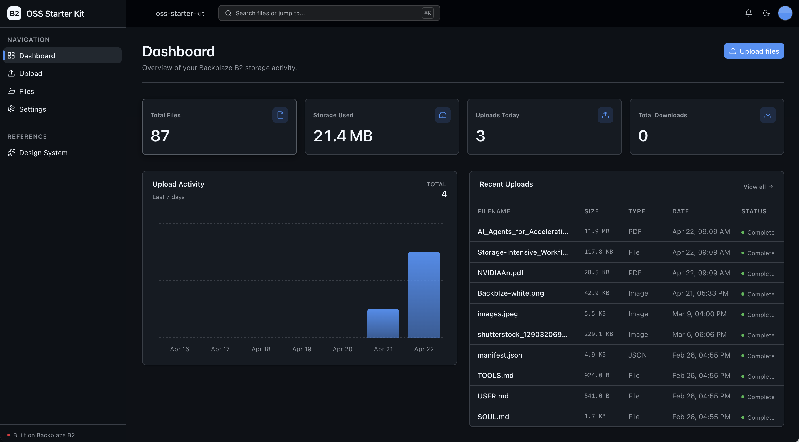
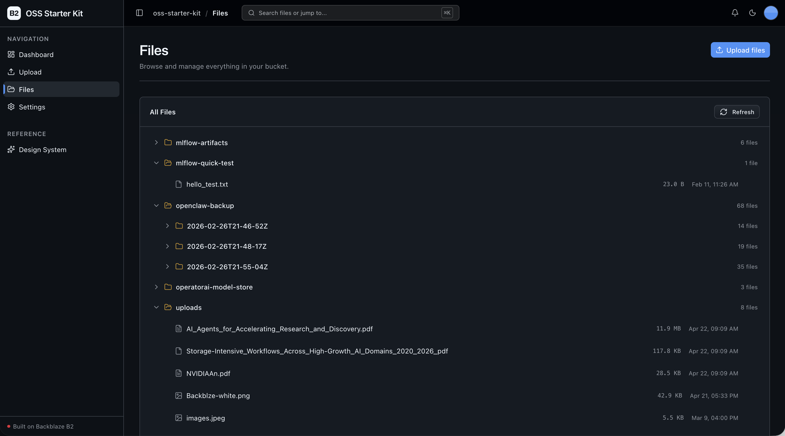

# AI SaaS Starter Kit

[](LICENSE)
[](https://github.com/backblaze-labs/ai-saas-starter-kit/actions/workflows/ci.yml)


**Production-ready Next.js + FastAPI SaaS template with Supabase auth, Stripe billing, AI image generation, and Backblaze B2 storage.**

Stop wiring boilerplate and start building.

**AI SaaS Starter Kit** is an open-source, production-ready template for building AI SaaS applications on a full-stack TypeScript (Next.js 16) and Python (FastAPI) monorepo. It ships authentication (Supabase), subscription billing (Stripe), an AI text-to-image workflow (NVIDIA NIM + Genblaze SDK), an admin console, and a **[Backblaze B2](https://www.backblaze.com/sign-up/ai-cloud-storage?utm_source=github&utm_medium=referral&utm_campaign=ai_artifacts&utm_content=b2ai-ai-saas-starter-kit)**–backed file manager out of the box — so developers and AI coding agents can skip weeks of auth, billing, and storage boilerplate and go straight to their app's unique features. B2 gives AI apps S3-compatible object storage at a fraction of typical cloud egress cost, so generated media and uploads stay cheap at scale. MIT-licensed.

**What you get out of the box:**
- **Authentication** — Supabase email/password + email-code (OTP) sign-in, protected routes, profiles, and an admin role
- **Subscription billing** — Stripe Checkout + Billing Portal, Free/Pro/Team plans, webhook→database sync, and plan-gating
- **AI image generation** — a text-to-image workflow (NVIDIA NIM `flux.1-dev`) orchestrated by the Genblaze SDK, written to B2 with a SHA-256 provenance manifest
- **Admin console** — filterable, paginated DataGrids over users, subscriptions, jobs, files, and provider runs, plus an audit log
- **File manager** — drag-and-drop upload with progress + a browser with preview, download, and delete; uploads return rich file metadata (checksums, dimensions, EXIF) in the API response
- **Full-stack UI** (Next.js 16 + React 19 + Tailwind v4 + shadcn/ui) on a strictly layered FastAPI backend with structural tests
- **Agent-optimized docs** — your AI coding agent can read the repo and start contributing immediately

## Contents

- [What it looks like](#what-it-looks-like)
- [Agent-First Architecture](#agent-first-architecture)
- [Quick Start](#quick-start)
- [Building Your App](#building-your-app)
- [Deploy](#deploy)
- [Core Features](#core-features)
- [Tech Stack](#tech-stack)
- [Commands](#commands)
- [FAQ](#faq)
- [Documentation Map](#documentation-map)

## What it looks like

**Dashboard** — stats, upload activity, and recent uploads at a glance:



**File browser** — tree view with preview, download, and delete:



## Agent-First Architecture

This repo is optimized for coding agents. Use the template, point your agent at it, and start building.

The structure follows the principle that **repository knowledge is the system of record**. Anything an agent can't access in-context doesn't exist — so everything it needs to reason about the codebase is versioned, co-located, and discoverable from the repo itself.

### How it works

**[AGENTS.md](AGENTS.md) is the single source of truth for all coding agents.** A compact (~150-line) entry point gives agents the repository layout, architectural invariants, commands, conventions, and pointers to deeper docs. Agent-specific files (CLAUDE.md, etc.) are thin pointers back to AGENTS.md.

**Architecture is enforced mechanically, not by convention.** Layering rules, import boundaries, file size limits, and SDK containment are verified by structural tests and lints that run on every change. When rules are enforceable by code, agents follow them reliably.

**The knowledge base is structured for progressive disclosure:**

```
AGENTS.md              Single source of truth — layout, invariants, commands, conventions
ARCHITECTURE.md        System layout, layering rules, data flows
docs/
  features/            Feature docs (inputs, outputs, flows, edge cases)
  app-workflows.md     User journeys
  dev-workflows.md     Engineering workflows and testing
  SECURITY.md          Security principles
  RELIABILITY.md       Reliability expectations
  exec-plans/          Execution plans and tech debt tracker
```

### Key design decisions

Every architectural rule is enforced mechanically, not by convention: a strict layered backend (`types -> config -> repo -> service -> runtime`), external SDKs contained to the `repo/` layer, a 300-line-per-file limit, and DRY docs updated in the same PR as the code — all verified by structural tests, ruff, and ESLint on every change. The full contract lives in **[AGENTS.md](AGENTS.md)** and **[ARCHITECTURE.md](ARCHITECTURE.md)**.

This approach draws from [OpenAI's experience building with Codex](https://openai.com/index/harness-engineering/): agents work best in environments with strict boundaries, predictable structure, and progressive context disclosure.

## Quick Start

You need: Node.js >= 20, pnpm >= 9, Python >= 3.11, and a free **[Backblaze B2 account](https://www.backblaze.com/sign-up/ai-cloud-storage?utm_source=github&utm_medium=referral&utm_campaign=ai_artifacts&utm_content=b2ai-ai-saas-starter-kit)**.

### Start a new project

**Option 1: GitHub Template (recommended)**

Click the green **"Use this template"** button at the top of this repo, name your project, then:

```bash
git clone https://github.com/yourorg/my-cool-app.git
cd my-cool-app
```

**Option 2: Clone and reinitialize**

```bash
git clone https://github.com/backblaze-labs/ai-saas-starter-kit.git my-cool-app
cd my-cool-app
rm -rf .git
git init
git add .
git commit -m "Initial commit from ai-saas-starter-kit"
```

Either way you get a clean project with no upstream history — ready to push to your own repo and point your agent at it.

### Setup

> **TL;DR (local).** Auth, uploads, and the file manager need only **B2 + a local Supabase stack** — Stripe billing and AI generation are optional (their endpoints return a clean `503` until configured). After cloning:
>
> ```bash
> pnpm install
> cd services/api && python -m venv .venv && source .venv/bin/activate && pip install -r requirements.txt && cd ../..
> cp .env.example .env          # then paste your B2 bucket + app key into .env (step 3)
> supabase start && node scripts/sync-supabase-env.mjs
> pnpm dev                      # http://localhost:3000 — the first signup becomes admin
> ```
>
> The steps below expand each of these, plus the optional Stripe (step 5) and AI (step 6) setup.

**1. Install dependencies**

```bash
pnpm install
```

**2. Set up the backend**

```bash
cd services/api
python -m venv .venv && source .venv/bin/activate
pip install -r requirements.txt
cd ../..
```

**3. Add your B2 credentials**

Set up your local `.env`:

```bash
cp .env.example .env
```

Open `.env` in your editor and keep it visible. Then head to the [Backblaze B2 dashboard](https://secure.backblaze.com/b2_buckets.htm?utm_source=github&utm_medium=referral&utm_campaign=ai_artifacts&utm_content=b2ai-ai-saas-starter-kit) and:

1. **Create a bucket.** Paste each value into `.env`:
   - **Bucket Unique Name** → `B2_BUCKET_NAME`
   - The bucket's **region** (e.g. `us-west-004`) → `B2_REGION` — the S3 endpoint is derived from this (`https://s3.{B2_REGION}.backblazeb2.com`), so there's no separate endpoint variable.
   - **Public URL base** for the bucket (e.g. `https://<bucket>.s3.<region>.backblazeb2.com`) → `B2_PUBLIC_URL_BASE`.
2. **Create an application key** with `Read and Write` permission. B2 will show two values — paste each into `.env`:
   - **keyID** → `B2_APPLICATION_KEY_ID`
   - **applicationKey** → `B2_APPLICATION_KEY` *(only shown once — paste it now)*

> Want a walkthrough? See the docs for [creating a bucket](https://www.backblaze.com/docs/cloud-storage-create-and-manage-buckets?utm_source=github&utm_medium=referral&utm_campaign=ai_artifacts&utm_content=b2ai-ai-saas-starter-kit) and [creating app keys](https://www.backblaze.com/docs/cloud-storage-create-and-manage-app-keys?utm_source=github&utm_medium=referral&utm_campaign=ai_artifacts&utm_content=b2ai-ai-saas-starter-kit).

**4. Set up Supabase (auth + database)**

Authentication and the user database run on [Supabase](https://supabase.com). Use a **local** stack (default, zero cloud setup) or a **hosted** project — the app is identical either way, only the env vars differ.

*Local (recommended for development)* — needs Docker (e.g. [Colima](https://github.com/abiosoft/colima) or Docker Desktop) and the Supabase CLI (`brew install supabase/tap/supabase`):

```bash
supabase start                       # boots Postgres + Auth + Studio + Mailpit
node scripts/sync-supabase-env.mjs   # writes the local Supabase keys into .env
```

`supabase start` applies the migrations in `supabase/migrations/` (a `profiles` table, a `roles` catalog, and RLS). Confirmation and magic-link emails are caught by Mailpit at `http://127.0.0.1:54324` — nothing is sent to a real inbox locally. **The first user to sign up becomes an admin.**

*Hosted (staging/production)* — create a project at [supabase.com](https://supabase.com), then **link the CLI before pushing** so `db push` knows which project to target:

```bash
supabase login                                   # once per machine (opens the browser)
supabase link --project-ref <your-project-ref>   # ref = your project URL subdomain, or Settings → General
supabase db push                                 # applies the 4 migrations to the hosted DB
```

Then copy **Project Settings → API** into `.env`: the project URL into `NEXT_PUBLIC_SUPABASE_URL`, the anon/publishable key into `NEXT_PUBLIC_SUPABASE_ANON_KEY`, and the service-role key into `SUPABASE_SERVICE_ROLE_KEY` (**server-only — never expose it to the browser**). The backend reads the URL + anon key from the same `NEXT_PUBLIC_*` pair, so there is nothing to duplicate. Full walkthrough in [docs/deployment.md](docs/deployment.md). Swapping local ↔ hosted is config-only.

> ⚠️ **Hosted admin:** the first user to sign up is auto-promoted to admin (handy locally). On a public hosted deploy, sign up yourself first, or remove the auto-promote branch in the migration and grant admin manually. See [docs/SECURITY.md](docs/SECURITY.md).

**5. Set up Stripe billing (optional)**

Billing is powered by [Stripe](https://stripe.com). The app boots fine without it — the billing endpoints just return `503` and the file manager works unchanged — so you can skip this and come back later. To enable it (test mode; needs the [Stripe CLI](https://stripe.com/docs/stripe-cli)):

1. Copy your **test-mode** secret key (`sk_test_...`) from the [Stripe Dashboard](https://dashboard.stripe.com/test/apikeys) into `STRIPE_SECRET_KEY` in `.env`.
2. Run `pnpm stripe:seed` — it creates the Pro/Team products + recurring prices and writes `STRIPE_PRICE_PRO` / `STRIPE_PRICE_TEAM` into `.env` for you (idempotent; no `price_...` copy-paste).
3. Run `pnpm stripe:listen` and copy the `whsec_...` it prints into `STRIPE_WEBHOOK_SECRET`. Leave it running — it forwards webhooks to your local API.
4. Restart `pnpm dev` (env is read at startup), then test checkout with card `4242 4242 4242 4242`.

New to Stripe? The [step-by-step Stripe billing setup guide](docs/stripe-setup.md) walks through all of this with zero Stripe experience assumed.

**6. Set up AI image generation (optional)**

The marquee `/generate` workflow turns a text prompt into an image via NVIDIA NIM (`flux.1-dev`), orchestrated by the [Genblaze](https://pypi.org/project/genblaze-core/) SDK and written to B2 with a SHA-256 provenance manifest. The app boots fine without it — the endpoint returns a clean `503` — so this is optional. To enable it, grab a free key with starter credits at [build.nvidia.com](https://build.nvidia.com) (it looks like `nvapi-...`) and set `NVIDIA_API_KEY` in `.env`. Generation is **Pro-gated**, so sign in on a Pro plan (a Stripe test checkout is enough) to try it. The model and image size are configurable via `NVIDIA_IMAGE_MODEL` and the `GENERATION_*` settings in `services/api/app/config/settings.py`.

**7. Run it**

```bash
pnpm dev
```

That's it. Frontend at `localhost:3000`, API at `localhost:8000`. Sign up to create your account (the first user is an admin), then upload a file and see it working.

`pnpm dev` runs `pnpm doctor` first — a preflight check that catches the common setup gotchas (wrong Node/Python version, missing venv, missing or placeholder `.env`, ports already taken) and tells you exactly how to fix each one. Run it standalone any time with `pnpm doctor`.

## Building Your App

When you adapt this kit for a new app, keep the shared scaffolding and only swap out what's app-specific:

- **Keep** the UI kit (`apps/web/src/components/ui/` + design tokens in `globals.css` + `/design`).
- **Keep** the auth layer (Supabase sign in/up, protected routes, `/account`, roles/admin) — it's the reusable SaaS foundation.
- **Keep** the billing layer (Stripe Checkout/Portal, `/billing`, plans, webhook sync, and the `require_plan` gate) — swap the plan definitions/prices for your product, not the plumbing.
- **Keep** the File Explorer (`/files`) and Upload (`/upload`) pages and their sidebar nav entries — they're the reusable B2-backed surface.
- **Adapt** the Dashboard (`/`) to your use case — replace the default stats, chart, and recent uploads with metrics that reflect what your app actually does.
- **Rebrand** by editing a single file: `apps/web/src/lib/app-config.ts` holds the app name and description (`APP_NAME`, `APP_DESCRIPTION`). Changing them there updates the page title, sidebar, and breadcrumb everywhere — no other files to touch.

Full contract and rationale: [AGENTS.md §2 — Building on This Starter Kit](AGENTS.md#2-building-on-this-starter-kit).

## Deploy

Deploy the **frontend** to Vercel in one click, then host the **backend** (FastAPI) on Railway, Render, or Fly.io:

[](https://vercel.com/new/clone?repository-url=https%3A%2F%2Fgithub.com%2Fbackblaze-labs%2Fai-saas-starter-kit&root-directory=apps%2Fweb&project-name=ai-saas-starter-kit&repository-name=ai-saas-starter-kit&env=NEXT_PUBLIC_API_URL,NEXT_PUBLIC_SUPABASE_URL,NEXT_PUBLIC_SUPABASE_ANON_KEY&envDescription=The%20frontend%20needs%20your%20backend%20API%20origin%20plus%20your%20Supabase%20project%20URL%20and%20anon%20key&envLink=https%3A%2F%2Fgithub.com%2Fbackblaze-labs%2Fai-saas-starter-kit%2Fblob%2Fmain%2Fdocs%2Fdeployment.md)

> When importing, set the **Root Directory** to `apps/web` (this is a pnpm monorepo). Deploy the backend first so you have its URL for `NEXT_PUBLIC_API_URL`.

Full production topology — Vercel + Railway/Render/Fly, hosted Supabase, Stripe live-mode, and B2 — is in **[docs/deployment.md](docs/deployment.md)**.

## Core Features

- [Authentication](docs/features/authentication.md) — Supabase email/password + email-code (OTP) sign-in, protected routes, profiles, and an admin role
- [Billing](docs/features/billing.md) — Stripe Checkout + Billing Portal, Free/Pro/Team plans, webhook→Supabase sync, and plan-gating (`require_plan`)
- [AI Image Generation](docs/features/generation.md) — text-to-image (NVIDIA NIM `flux.1-dev`) via the Genblaze SDK → B2 with a SHA-256 provenance manifest; Pro-gated, and outputs land in the file manager
- [Admin Console](docs/features/admin.md) — filterable, paginated DataGrids (users, subscriptions, jobs, files, provider runs) + an audit log; admin-gated
- [File Upload](docs/features/file-upload.md) — drag-and-drop upload with real-time progress
- [File Browser](docs/features/file-browser.md) — list, preview, download, delete files
- [Dashboard](docs/features/dashboard.md) — stats cards, upload chart, recent uploads
- [Upload Metadata](docs/features/metadata-extraction.md) — the upload API returns rich metadata (checksums, image dimensions, EXIF, PDF info) in its response; the file browser surfaces basic metadata (size, type, upload date)
- [Design System](docs/design-system.md) — tokens, primitives, AI elements, the blaze generating loader, and inline `ErrorState` / `EmptyState` patterns. Live preview at `/design`.
- Inline error handling — fetch failures surface *what's wrong* (API offline, 401, 5xx) and offer a Retry, instead of silently rendering empty state.
- Single-source config — one `.env` at the repo root powers both API and web app, validated at startup so misconfig fails fast with a readable message.
- Centralized data layer — every fetch goes through TanStack Query hooks in `apps/web/src/lib/queries.ts`; cache invalidation is one call after a mutation.
- Production-grade observability & guardrails — structural tests (layering rules, import boundaries, SDK containment, file-size limits), structured JSON request logging with tracing, and `/health` + `/metrics` endpoints. Details in [ARCHITECTURE.md](ARCHITECTURE.md) and [docs/RELIABILITY.md](docs/RELIABILITY.md).

## Tech Stack

- TypeScript, Next.js 16, React 19, Tailwind v4, shadcn/ui, Recharts
- TanStack Query — caching, dedup, retry, stale-while-revalidate for every fetch
- Python 3.11+, FastAPI, boto3, Pydantic v2, Pillow, PyPDF2, httpx
- Supabase (auth + Postgres; `@supabase/ssr` for cookie-based sessions)
- Stripe (subscriptions, Checkout, Billing Portal, webhooks)
- Backblaze B2 (S3-compatible object storage)
- pnpm workspaces (monorepo)

## Commands

| Command | What it does |
|---------|-------------|
| `pnpm dev` | Start frontend + backend |
| `pnpm dev:web` | Frontend only |
| `pnpm dev:api` | Backend only |
| `pnpm stripe:seed` | Create Stripe products/prices + write price IDs into `.env` (idempotent) |
| `pnpm stripe:listen` | Forward Stripe webhooks to the local API |
| `pnpm build` | Build frontend |
| `pnpm lint` | Lint frontend |
| `pnpm lint:api` | Lint backend (ruff) |
| `pnpm test:api` | Run backend tests |
| `pnpm test:web` | Run frontend tests (vitest) |
| `pnpm typecheck` | Type-check the frontend |
| `pnpm check:structure` | Verify layering rules |
| `pnpm test:e2e` | Playwright e2e tests (run `pnpm --filter @ai-saas-starter-kit/web exec playwright install chromium` once first) |

## FAQ

**What is the AI SaaS Starter Kit?**
It's an open-source, production-ready template for building AI SaaS applications on a full-stack Next.js 16 (TypeScript) + FastAPI (Python) monorepo, with Supabase authentication, Stripe subscription billing, an AI text-to-image workflow, an admin console, and a Backblaze B2–backed file manager wired in out of the box.

**Do I need all four services (B2, Supabase, Stripe, NVIDIA) to run it?**
No. Authentication, uploads, and the file manager need only **Backblaze B2 + a local Supabase stack**. Stripe billing and AI image generation are optional — their endpoints return a clean `503` until you configure them, and the rest of the app works unchanged.

**Is it production-ready, and what's the license?**
Yes — it ships with structural tests, structured logging, `/health` + `/metrics` endpoints, and a documented deploy path (Vercel + Railway/Render/Fly). It's **MIT-licensed**, so you're free to use it commercially.

**Can I use a different storage provider?**
The app talks to storage over the **S3-compatible API** (boto3), so it can point at any S3-compatible store — but it's built and tested for Backblaze B2, and the setup docs assume B2.

**Why Backblaze B2 for AI apps?**
B2 provides S3-compatible object storage at a fraction of the egress cost of the hyperscalers, so generated media, uploads, and datasets stay cheap to store *and* to serve as your app scales.

## Documentation Map

| Doc | Purpose |
|-----|---------|
| [AGENTS.md](AGENTS.md) | Agent table of contents — start here |
| [ARCHITECTURE.md](ARCHITECTURE.md) | System layout, layering, data flows |
| [docs/deployment.md](docs/deployment.md) | Production deploy — Vercel + Railway/Render/Fly, hosted Supabase, Stripe live-mode |
| [docs/stripe-setup.md](docs/stripe-setup.md) | Stripe billing setup — Stripe CLI, recurring prices, webhook signing secret, local Checkout testing |
| [docs/features/](docs/features/) | Feature docs (auth, billing, generation, admin, upload, browser, dashboard, metadata) |
| [docs/design-system.md](docs/design-system.md) | Design tokens, primitives, AI elements, loader, error/empty states |
| [docs/app-workflows.md](docs/app-workflows.md) | User journeys |
| [docs/dev-workflows.md](docs/dev-workflows.md) | Engineering workflows and testing |
| [docs/SECURITY.md](docs/SECURITY.md) | Security principles |
| [docs/RELIABILITY.md](docs/RELIABILITY.md) | Reliability expectations |
| [docs/exec-plans/](docs/exec-plans/) | Execution plans and tech debt tracker |

## Contributing

Start with [AGENTS.md](AGENTS.md) — it's the map, and everything else is discoverable from there. Open an issue or PR, and run `pnpm lint && pnpm test:api && pnpm check:structure` before submitting.

## Security

Found a vulnerability? Please report it privately via GitHub's **"Report a vulnerability"** button on the repo's [Security tab](https://github.com/backblaze-labs/ai-saas-starter-kit/security/advisories/new) rather than opening a public issue. For the security model and hardening details, see [docs/SECURITY.md](docs/SECURITY.md).

## License

MIT License - see [LICENSE](LICENSE) for details.

## Claude Agent B2 Skill

Manage Backblaze B2 from your terminal using natural language (list/search, audits, stale or large file detection, security checks, safe cleanup).

Repo: [https://github.com/backblaze-b2-samples/claude-skill-b2-cloud-storage](https://github.com/backblaze-b2-samples/claude-skill-b2-cloud-storage)